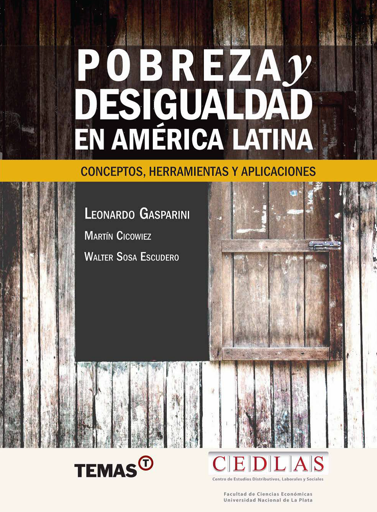

--- 
title: "Apéndices del Libro Pobreza y Desigualdad en R"
date: "`r Sys.Date()`"
site: bookdown::bookdown_site
documentclass: book
bibliography: [book.bib, packages.bib]
description: " Nos propusimos trasncribir al lenguaje R y Python los apéndices del libro Pobreza y Desigualdad en América Latina de Gasparini, Cicowiez y Sosa Escudero que originalmente fueron escritos para Stata."
link-citations: yes
github-repo: "crisbonavida/Pobreza_Desigualdad_codes"
cover-image: "portada_libro_cover.png"
always_allow_html: true

---

# Bienvenidos

## Sobre este Proyecto: {-}

Nos propusimos trasncribir al lenguaje R y Python los apéndices del libro "Pobreza y Desigualdad en América Latina" de Gasparini, Cicowiez y Sosa Escudero que originalmente fueron escritos para Stata y que permitían replicar los datos e información presentados por los autores en el texto. Cada capítulo consta de un apéndice con códigos que permiten llevar a la práctica los conceptos desarrollados. Aquí **los traducimos a nuevos lenguajes y los presentamos en un formato amigable para permitir que un público más amplio y de diversas disciplinas pueda aprovecharlos**. 

El objetivo de este mini-proyecto no es otro que poner a disposición de un público más amplio estas herramientas útiles y mantener actualizado un material único que permite adentrarse y trabajar sobre la temática de pobreza y desigualdad. Es por eso que este material es de carácter complementario a las explicaciones y detalles conceptuales que se presentan en el libro de texto y los apéndices.


## El Libro {-}

Si esta es la primera vez que te encontrás con este libro, antes de empezar con los códigos, dejanos presentartelo. 

El propósito del libro es ayudar al lector interesado en América Latina a que recorra el arduo camino entre los datos y el reporte de resultados rigurosos que puedan contribuir al debate sobre la pobreza y la desigualdad en America Latina. El volumen poner al alcance del lector un conjunto de instrumentos que lo motiven hacia la investigación empírica, y que le permitan producir resultados de la manera más rigurosa posible, para así contribuir a los objetivos últimos de explicar y cambiar la realidad social de la región. Las discusiones conceptuales y analíticas son ilustradas con ejemplos concretos construidos con datos de los países de la región.

```{r, echo=FALSE, out.width='60%', fig.asp=.75, fig.align='center' }

```

Una enorme ventaja de este trabajo es que se encuentra disponible para todos, ya que se lo puede descargar gratuitamente desde el la [página del libro](https://www.cedlas.econo.unlp.edu.ar/wp/publicaciones/libros/pobreza-y-desigualdad-en-america-latina/). Te invitamos a que puedas recorrerlo, leerlo y dedicarle varios minutos antes de adentrarte en estos códigos. 


## Cómo aprovechar este material {-}

Un punto importante es que estos códigos que te presentamos están atados a los contenidos y explicaciones que se desarrollan a lo largo de los capítulos del libro. Por eso notarás que los códigos no son autocontenidos al 100%, es decir si bien refuerzan las ideas principales detrás de cada indicador, de cada gráfico o cada estimación, y están acompañados de instrucciones generales, no cubren en profundidad los conceptos teóricos e incluso prácticos detrás de su uso. Por es que decimos que **este material es de carácter complementario a las explicaciones y detalles conceptuales que se presentan en el libro de texto y los apéndices**. Para aprovecharlas al máximo te recomendamos tener abierta junto con la pestaña de R o Python, el pdf del libro de texto para ir siguiendo capitulo a capitulo los contenidos. De esta forma no solo será posible replicar las estimaciones sino también comprenderlas y saber entender qué nos dicen y que no nos dicen.


## Qué es y qué no es {-}

Es importante setear las expectativas desde el principio. En estos códigos vas a encontrar mucha información y muchos temas a cubrir, mientras que otros nos quedarán para una próxima entrega. En este sentido, este material **no busca ser una guía exhaustiva a modo de tutorial para iniciarse en el lenguaje de programación**. El propósito será seguir los códigos presentados en los apéndices del libro con la misma estructura temática y con el objetivo de facilitar nuevas herramientas al usuario en base a los que ya fue escrito. Por lo que si bien el material es útil para entrenarse en este lenguaje,  es más bien un proyecto que permite expandir sobre conocimientos y nociones previas. Es por eso que  se recomienda que el lector ya esté algo familiarizado con la sintaxis y el programa. Si no este no es tu caso,  no te preocupes!, te vamos a dejar a continuación  varias referencias para que puedas entrar en calor y ponerte a punto antes de empezar.

* Tutoriales para inciarse en R

  + https://martinmontane.github.io/CienciaDeDatosBook/index.html
  
  + https://diegokoz.github.io/Curso_R_EPH_clases/


* Para hacer el camino desde Stata

  +	https://www.matthieugomez.com/statar/index.html


## Qué necesitamos antes de arrancar {-}

Para poder seguir los códigos que te presentamos vas a necesitar descargarte (o al menos tener acceso) a las bases de datos sobre las que iremos trabajando. Estas bases de datos son las encuestas que desarrolla cada país y que el CEDLAS sistematiza para ofrecerlas en un formato usable para los investigadores. En el siguiente [link](https://www.cedlas.econo.unlp.edu.ar/wp/publicaciones/libros/pobreza-y-desigualdad-en-america-latina/#1505501369949-15c93bca-b4f8) encontrarás el repositorio.
